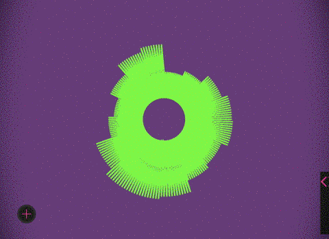

# Color.V1b.es - Music.V1b.es



A little experiment to visualize Music with js based on „simple“ math functions. Hopefully editable in the future to make some trippy patterns by yourself!
- - - -
## How it works
```
  x = CENTER.x + RADIUS * Math.sin( (i * 2 * Math.PI) / POINTS ),
  y = CENTER.y + RADIUS * -Math.cos( (i * 2 * Math.PI) / POINTS ),
  x_2 = CENTER.x + (fbc[rel]) * Math.sin( (i * 2 * Math.PI) / POINTS ),
  y_2 = CENTER.y + (fbc[rel]) * -Math.cos( (i * 2 * Math.PI) / POINTS );
```
you can get some very trippy and awesome patterns just by editing some of the values. _Try tan instead of cos or sin for example_
- - - -
## Todo
- [x] Volume control
- [x] play/pause
- [x] multiple songs
- [ ] individual Songs
- [ ] transitions
- [ ] editable colors
- [ ]  editable functions
- [ ] playlist

- - - -
made with / by v1b.es
